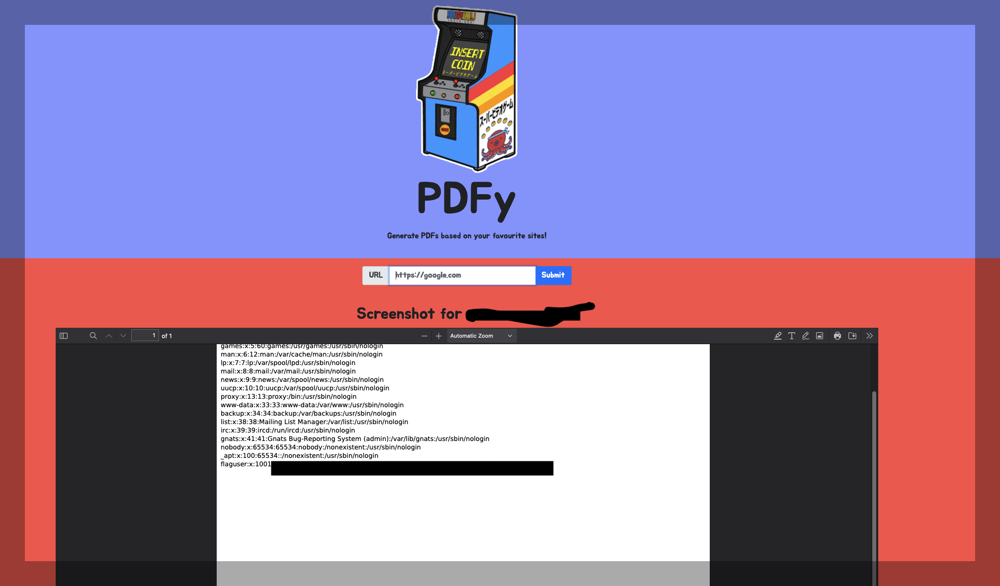

**Difficulty:** Easy

## First look
The application is pretty straightforward: it has a single form that takes a string input. If the string is a URL, the app generates a PDF of the webpage. There’s not much to see except for some JavaScript. Below is the JavaScript code, main.js, with added details and an improved explanation for better understanding.

This JavaScript code handles form submissions on the webpage. Specifically, it processes a URL input, sends it to a backend API, and displays a PDF screenshot of the corresponding webpage. Here's a detailed breakdown of the code:

### Variable Declarations

```javascript
const form       = document.getElementById('form');
const url        = document.getElementById('url');
const alerts     = document.getElementById('alerts');
const screenshot = document.getElementById('screenshot');
const loading    = document.getElementById('loading');
```

These lines select various HTML elements by their IDs and store them in constants for later use.

### Flash Function

```javascript
const flash = (message, level) => {
    alerts.innerHTML += `
        <div class="alert alert-${level}" role="alert">
            <button type="button" id="closeAlert" class="close" data-dismiss="alert" aria-label="Close"><span aria-hidden="true">&times;</span></button>
            <strong>${message}</strong>
        </div>
    `;
};
```

This function displays an alert message in the alerts element. The level parameter determines the type of alert (e.g., warning, success).

### Form Submission Event Listener

```javascript
form.addEventListener('submit', e => {
    e.preventDefault(); // Prevent default form submission behavior

    // Clear previous alerts and screenshot
    alerts.innerHTML = '';
    screenshot.innerHTML = '';

    // Check if the URL input is empty
    if (url.value.trim().length == 0) return flash('URL can\'t be empty', 'warning');

    // Show loading indicator
    loading.style.display = 'block';

    // Send a POST request to the server with the URL
    // API call
    fetch('/api/cache', {
        method: 'POST',
        body: JSON.stringify({
            'url': url.value
        }),
        headers: {
            'Content-Type': 'application/json'
        }
    })
    .then(resp => resp.json()) // Parse the JSON response
    .then(resp => {
        // Display a message if there is one
        if (resp.message) {
            flash(resp.message, resp.level);
            
            // Automatically close the alert after 2800ms
            setTimeout(() => {
                document.getElementById('closeAlert').click();
            }, 2800);
        }

        // Display the screenshot if a domain is returned
        if (resp.domain) {
            screenshot.innerHTML += `
                <h2>Screenshot for <a href="${url.value}" target="_blank">${resp.domain}</a></h2>
                <iframe src="/static/pdfs/${resp.filename}" frameborder="0" scrolling="no" style="height:100vh;width:65%;"></iframe>
            `;
        }
    })
    .then(() => {
        // Clear the URL input and hide the loading indicator
        url.value = '';
        loading.style.display = 'none';
    });
});
```

## Blind Assumptions
It's not best practice to make assumptions, but for this easy challenge, it was acceptable. The potential exploit vector follows this path:

SSRF -> Exploit something in the parser -> ??? -> Profit

**BUT!**
How is the PDF generated? The answer is **wkhtmltopdf**.

How do I know? When I directly contacted the /api/cache endpoint from main.js and sent a non-existing URL, I got this response:


```http
HTTP/1.1 200 OK
Server: Werkzeug/3.0.2 Python/3.12.2
Date: Tue, 06 Aug 2024 09:29:06 GMT
Content-Type: application/json
Content-Length: 312
Connection: close

{
  "level": "error",
  "message": "There was an error: Error generating PDF: Command '['wkhtmltopdf', '--margin-top', '0', '--margin-right', '0', '--margin-bottom', '0', '--margin-left', '0', 'http://google1.com', 'application/static/pdfs/cccc0ed9a20dcd4975f7c9f03f38.pdf']' returned non-zero exit status 1."
}

```

### wkhtmltopdf

I googled it and found some interesting links:

[Owning the cloud through SSRF and PDF generators](https://docs.google.com/presentation/d/1JdIjHHPsFSgLbaJcHmMkE904jmwPM4xdhEuwhy2ebvo/edit#slide=id.g5df2243028_0_107)

[High Vulnerability in Wkhtmltopdf 0.12.6](https://it.ucsf.edu/high-vulnerability-wkhtmltopdf-0126)

[wkhtmltopdf SSRF](https://exploit-notes.hdks.org/exploit/web/security-risk/wkhtmltopdf-ssrf/)

Quick look:

**wkhtmltopdf** is a popular open-source PDF and image rendering utility. If used improperly, it can introduce significant security vulnerabilities. Since wkhtmltopdf renders HTML content server-side, it's a prime target for both Server-side Request Forgery (SSRF) and Local File Inclusion (LFI).

The following payload can exploit this vulnerability:

```php
<?php header('location:file:///etc/passwd); ?>
```

## Exploit
Using a PHP payload uploaded to my VPS, I was able to exploit the vulnerability. After sending the URL to the payload, I received the flag.




